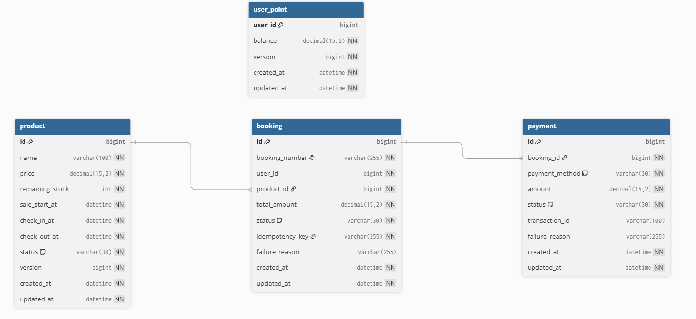

# booking-core
예약/결제 시스템의 핵심 도메인 모델 및 DB 스키마를 구현한 프로젝트입니다.

---

## 실행 방법

1. Docker Desktop 설치
2. Redis 실행
   docker run -d --name redis -p 6379:6379 redis:7
3. Spring Boot 실행
4. data.sql 실행 (초기 데이터 세팅)

---

## 도메인

### Product
예약 가능한 상품 정보 및 재고 관리
- 상품명
- 가격
- 잔여 재고
- 판매 시작 시간
- 체크인 / 체크아웃 시간
- 상품 상태 (ACTIVE / SOLD_OUT / INACTIVE)

### Booking
사용자의 예약 정보 관리
- 예약 번호
- 사용자 ID
- 예약 상품
- 총 결제 금액
- 예약 상태 관리
- 멱등성 키(idempotency key)

### Payment
예약에 대한 결제 정보 관리
- 복합 결제 지원 (1:N)
- 결제 수단
- 결제 금액
- 결제 상태
- 거래 ID

### UserPoint
사용자 포인트 관리
- 포인트 잔액
- 포인트 사용 / 복구
- Optimistic Lock 적용

---

## ERD


---

## DDL Schema
```sql
Table product {
  id bigint [pk, increment]
  name varchar(100) [not null]
  price decimal(15,2) [not null]
  remaining_stock int [not null]
  sale_start_at datetime [not null]
  check_in_at datetime [not null]
  check_out_at datetime [not null]
  status varchar(30) [not null, note: 'ACTIVE | SOLD_OUT | INACTIVE']
  version bigint [not null]

  created_at datetime [not null]
  updated_at datetime [not null]
}

Table booking {
  id bigint [pk, increment]
  booking_number varchar(255) [not null, unique]
  user_id bigint [not null]
  product_id bigint [not null]
  total_amount decimal(15,2) [not null]
  status varchar(30) [not null, note: 'INIT | PAYMENT_PENDING | CONFIRMED | FAILED | CANCELLED']
  idempotency_key varchar(255) [not null, unique]
  failure_reason varchar(255)

  created_at datetime [not null]
  updated_at datetime [not null]
}

Table payment {
  id bigint [pk, increment]
  booking_id bigint [not null]
  payment_method varchar(30) [not null, note: 'CARD | YPAY | POINT']
  amount decimal(15,2) [not null]
  status varchar(30) [not null, note: 'READY | SUCCESS | FAILED | CANCELLED']
  transaction_id varchar(100)
  failure_reason varchar(255)

  created_at datetime [not null]
  updated_at datetime [not null]
}

Table user_point {
  user_id bigint [pk]
  balance decimal(15,2) [not null]
  version bigint [not null]

  created_at datetime [not null]
  updated_at datetime [not null]
}

Ref: booking.product_id > product.id
Ref: payment.booking_id > booking.id
```