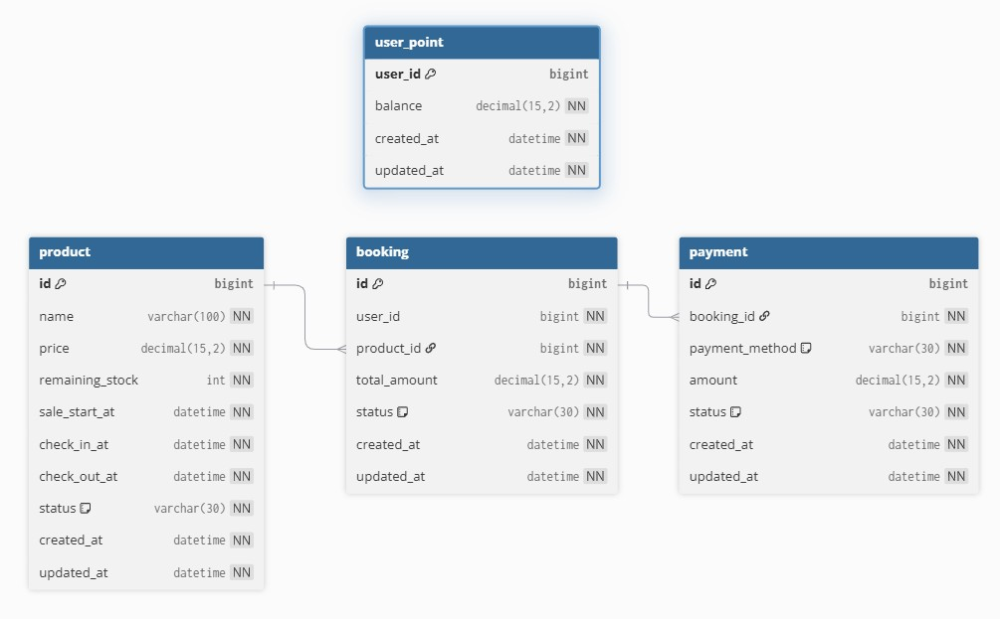

# booking-core
예약/결제 시스템의 핵심 도메인 모델 및 DB 스키마를 구현한 프로젝트입니다.

---

## 실행 방법

1. Docker Desktop 설치
2. Redis 실행
   docker run -d --name redis -p 6379:6379 redis:7
3. 환경 변수 세팅
4. Spring Boot 실행
5. data.sql 실행 (초기 데이터 세팅)

---

## 전체 예약/결제 플로우

```text
┌──────────────────────────────────────────────────────────┐
│                    예약 요청 (reserve)                   │
└──────────────────────────────────────────────────────────┘
                            │
                            ▼
                 Redis Lua 선점 검증
        ┌────────────────────────────────┐
        │ - 중복 예약 검증               │
        │ - 결제 완료 여부 검증          │
        │ - 재고 수량 검증               │
        │ - TTL 기반 임시 선점 처리      │
        └────────────────────────────────┘
                            │
             ┌──────────────┴──────────────┐
             ▼                             ▼
      SOLD_OUT / FAIL                 SUCCESS
                                            │
                                            ▼
                           Booking 생성 (INIT)
                                            │
                                            ▼
┌──────────────────────────────────────────────────────────┐
│              결제 수단 등록 (payments/register)          │
└──────────────────────────────────────────────────────────┘
                            │
                            ▼
                Payment 엔티티 생성
        ┌────────────────────────────────┐
        │ - POINT                        │
        │ - CARD                         │
        │ - YPAY                         │
        │ - 복합 결제 지원               │
        └────────────────────────────────┘
                            │
                            ▼
┌──────────────────────────────────────────────────────────┐
│            외부 PG 승인 (payments/pg-approve)            │
└──────────────────────────────────────────────────────────┘
                            │
                            ▼
                 PgPaymentClient 호출
        ┌────────────────────────────────┐
        │ approve(paymentId, amount)    │
        └────────────────────────────────┘
                            │
             ┌──────────────┴──────────────┐
             ▼                             ▼
         PG FAIL                      PG SUCCESS
             │                             │
             ▼                             ▼
      Payment FAILED            Payment SUCCESS
                                            │
                                            ▼
                            Booking PAYMENT_PENDING
                                            │
                                            ▼
┌──────────────────────────────────────────────────────────┐
│               최종 예약 확정 (complete)                  │
└──────────────────────────────────────────────────────────┘
                            │
                            ▼
        ┌────────────────────────────────┐
        │ - 포인트 차감                  │
        │ - Redis 결제 완료 처리         │
        │ - 재고 차감                    │
        │ - Booking CONFIRMED            │
        └────────────────────────────────┘
                            │
             ┌──────────────┴──────────────┐
             ▼                             ▼
          SUCCESS                       EXCEPTION
                                              │
                                              ▼
                              BookingFailedEvent 발행
                                              │
                                              ▼
┌──────────────────────────────────────────────────────────┐
│                AFTER_ROLLBACK 보상 처리                  │
└──────────────────────────────────────────────────────────┘
                            │
                            ▼
        ┌────────────────────────────────┐
        │ - PG 결제 취소(cancel)         │
        │ - Payment CANCELLED            │
        │ - Booking FAILED               │
        │ - Redis 상태 복구              │
        └────────────────────────────────┘
```

---

## ERD


---

## DDL Schema
```sql
Table product {
  id bigint [pk, increment]
  name varchar(100) [not null]
  price decimal(15,2) [not null]
  remaining_stock int [not null]
  sale_start_at datetime [not null]
  check_in_at datetime [not null]
  check_out_at datetime [not null]
  status varchar(30) [not null, note: 'ACTIVE | SOLD_OUT | INACTIVE']

  created_at datetime [not null]
  updated_at datetime [not null]
}

Table booking {
  id bigint [pk, increment]
  user_id bigint [not null]
  product_id bigint [not null]
  total_amount decimal(15,2) [not null]
  status varchar(30) [not null, note: 'INIT | PAYMENT_PENDING | CONFIRMED | FAILED | CANCELLED']

  created_at datetime [not null]
  updated_at datetime [not null]
}

Table payment {
  id bigint [pk, increment]
  booking_id bigint [not null]
  payment_method varchar(30) [not null, note: 'CARD | YPAY | POINT']
  amount decimal(15,2) [not null]
  status varchar(30) [not null, note: 'READY | SUCCESS | FAILED | CANCELLED']

  created_at datetime [not null]
  updated_at datetime [not null]
}

Table user_point {
  user_id bigint [pk]
  balance decimal(15,2) [not null]

  created_at datetime [not null]
  updated_at datetime [not null]
}

Ref: booking.product_id > product.id
Ref: payment.booking_id > booking.id
```